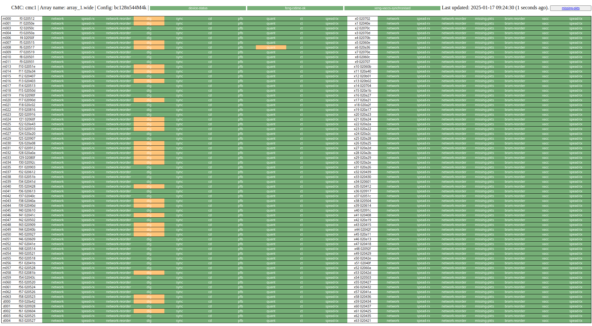

# CBF Sensor Dashboard v1.0

This is a quick-and-dirty browser-based sensor dashboard for the CBF.
It makes connections to every CMC listed in its config file, and hosts a simple
HTTP server to which you can connect a browser and see the state of the correlators
that are running.

### To install:

1. Clone this repo.
1. Clone `katcp_devel` into the same folder as `cbf_sensor_dashboard` is cloned, and build `katcp`, because this software depends on it for some functionality.
1. `cd` into the `cbf_sensor_dashboard` directory.
    1. `make`
    1. `sudo make install`

If there were no errors, the softare is now installed as a systemd service, and should run more or less continuously. Point a browser to `localhost`, or the IP or hostname of the computer on which the software is installed, if from another machine.

